# diffai

> **AI/ML specialized diff tool for PyTorch, Safetensors, NumPy, and MATLAB files**

[](https://github.com/kako-jun/diffai/actions/workflows/ci.yml)
[](https://crates.io/crates/diffai)
[](https://www.npmjs.com/package/diffai-js)
[](https://pypi.org/project/diffai-python/)

## 🤔 The Problem

Traditional diff tools fail completely with AI/ML workflows:

```mermaid
graph LR
    A[ML Engineer] --> B[Compare Models]
    B --> C{Traditional Tools}
    C --> D["❌ Binary files differ"]
    C --> E["❌ No semantic understanding"]  
    C --> F["❌ Memory issues with GB+ files"]
    D --> G[😞 No actionable insights]
    E --> G
    F --> G
```



**Reality Check:** When you need to compare two PyTorch models, `git diff` and standard tools give you nothing useful.

## ✨ The Solution

diffai automatically analyzes AI/ML files and provides **11 specialized ML analysis functions** without any configuration:

```mermaid
graph LR
    A[ML Engineer] --> B[diffai model1.pt model2.pt]
    B --> C[🎯 11 Auto ML Analyses]
    C --> D[📊 Learning Rate Changes]
    C --> E[🔍 Gradient Health]
    C --> F[⚡ Quantization Effects]
    C --> G[📈 Convergence Patterns]
    D --> H[✅ Actionable Insights]
    E --> H
    F --> H
    G --> H
```



**Convention over Configuration:** No setup required - diffai detects AI/ML files and runs comprehensive analysis automatically.

## 🆚 vs Traditional Tools

| Challenge | Traditional Tools | diffai |
|-----------|------------------|---------|
| **Binary model files** | "Binary files differ" | 11 specialized ML analyses + tensor statistics |
| **Large files (GB+)** | Memory issues or failures | Efficient streaming with lawkit patterns |
| **ML semantics** | No understanding | Learning rate, gradients, quantization detection |
| **Automation** | Manual inspection required | JSON output for MLOps integration |
| **Scientific data** | Text-only comparison | NumPy/MATLAB statistical analysis |

## 🚀 Quick Demo

```bash
# Traditional diff: Useless for ML files
$ diff model_v1.safetensors model_v2.safetensors
Binary files model_v1.safetensors and model_v2.safetensors differ

# diffai: Comprehensive ML analysis automatically
$ diffai model_v1.safetensors model_v2.safetensors
learning_rate_analysis: old=0.001, new=0.0015, change=+50.0%, trend=increasing
optimizer_comparison: type=Adam, momentum_change=+2.1%, state_evolution=stable
gradient_analysis: flow_health=healthy, norm=0.021069, variance_change=+15.3%
quantization_analysis: mixed_precision=FP16+FP32, compression=12.5%, precision_loss=1.2%
convergence_analysis: status=converging, stability=0.92, plateau_detected=false
# ... + 6 more analyses automatically
  ~ fc1.weight: mean=-0.0002->-0.0001, std=0.0514->0.0716
  ~ fc2.weight: mean=-0.0008->-0.0018, std=0.0719->0.0883
```

## ✅ What diffai CAN do today

- **PyTorch/Safetensors files**: 11 automatic ML analysis functions
- **NumPy/MATLAB files**: Comprehensive tensor statistics (shape, mean, std, dtype)
- **Multiple output formats**: Human-readable CLI, JSON for automation, YAML for reports
- **Memory efficient**: Handles GB+ model files with streaming processing
- **Zero configuration**: Automatic analysis based on file format detection
- **MLOps integration**: JSON output for CI/CD pipelines and automation

## ❌ What diffai CANNOT do (be realistic)

- ❌ **TensorFlow formats** (.pb, .h5, SavedModel) - Use TensorBoard for these
- ❌ **ONNX models** - Consider netron for visualization
- ❌ **Live training monitoring** - Use wandb/tensorboard for real-time tracking
- ❌ **Model performance prediction** - Shows changes, not absolute performance
- ❌ **Automatic hyperparameter tuning** - Analysis only, no recommendations yet
- ❌ **General text/code files** - Use [diffx](https://github.com/kako-jun/diffx) for JSON/YAML/CSV

## 🔄 When to use diffai vs alternatives

| Your Goal | Use This Instead | Why |
|-----------|------------------|-----|
| Live training monitoring | TensorBoard, wandb | Real-time visualization during training |
| Model architecture visualization | netron, torchviz | Interactive network diagrams |
| Experiment tracking | MLflow, Neptune | Full experiment lifecycle management |
| Performance benchmarking | MLPerf, custom scripts | Focused on inference/training speed |
| General file comparison | diffx, git diff | Text-based structured data |

**diffai is best for:** Post-training model comparison, checkpoint analysis, and MLOps automation.

## 📥 Installation

```bash
# From crates.io (recommended)
cargo install diffai

# From source
git clone https://github.com/kako-jun/diffai.git
cd diffai && cargo build --release
```

## 🎯 Common Use Cases

### Research & Development
```bash
# Compare before/after fine-tuning
diffai pretrained_model.pt finetuned_model.pt
# Auto-detects: parameter changes, convergence patterns, gradient health
```

### MLOps & CI/CD
```bash
# Automated model validation in pipelines
diffai production_model.safetensors candidate_model.safetensors --output json
# Pipe to automated decision making based on analysis results
```

### Model Optimization
```bash
# Analyze quantization effects
diffai full_precision.pt quantized.pt
# Auto-detects: compression ratios, precision loss, performance impact
```

## 📚 Documentation

- **[Quick Start](docs/quick-start.md)** - Get up and running in 5 minutes
- **[ML Analysis](docs/ml-analysis.md)** - Understand the 11 automatic ML analysis functions
- **[File Formats](docs/formats.md)** - Supported formats and output options
- **[Examples](docs/examples/)** - Real usage examples and outputs
- **[API Reference](docs/reference/api-reference.md)** - Programming interfaces (Rust/Python/JavaScript)
- **[CLI Reference](docs/reference/cli-reference.md)** - Command-line options and usage

## 🔧 Technical Details

### Supported Formats
- **PyTorch** (.pt, .pth) - Full ML analysis + tensor statistics
- **Safetensors** (.safetensors) - Full ML analysis + tensor statistics  
- **NumPy** (.npy, .npz) - Tensor statistics only
- **MATLAB** (.mat) - Tensor statistics only

### The 11 Automatic ML Analysis Functions
1. **Learning Rate Analysis** - Training dynamics tracking
2. **Optimizer Comparison** - Adam/SGD state analysis
3. **Loss Tracking** - Convergence pattern detection
4. **Accuracy Tracking** - Performance metric evolution
5. **Model Version Analysis** - Checkpoint progression
6. **Gradient Analysis** - Flow health, vanishing/exploding detection
7. **Quantization Analysis** - Mixed precision (FP32/FP16/INT8/INT4) detection
8. **Convergence Analysis** - Learning curves, plateau detection
9. **Activation Analysis** - ReLU/GELU/Tanh distribution
10. **Attention Analysis** - Transformer mechanism detection
11. **Ensemble Analysis** - Multi-model structure detection

### Output Formats
```bash
# Human-readable (default)
diffai model1.pt model2.pt

# JSON for automation
diffai model1.pt model2.pt --output json

# YAML for reports  
diffai model1.pt model2.pt --output yaml

# Verbose diagnostics
diffai model1.pt model2.pt --verbose
```

## 🏗️ Built With

- **Rust** - Performance and memory safety
- **diffx-core** - Proven diff engine foundation
- **lawkit patterns** - Memory-efficient incremental statistics
- **Convention over Configuration** - Zero-setup philosophy

## 🤝 Contributing

We welcome contributions! See [CONTRIBUTING.md](CONTRIBUTING.md) for guidelines.

```bash
git clone https://github.com/kako-jun/diffai.git
cd diffai
cargo build && cargo test
```

## 📄 License

MIT License - see [LICENSE](LICENSE) file for details.

## 🔗 Related Projects

- **[diffx](https://github.com/kako-jun/diffx)** - General-purpose structured data diff (JSON, YAML, CSV, XML)
- **[lawkit](https://github.com/kako-jun/lawkit)** - Memory-efficient data processing patterns
- **[safetensors](https://github.com/huggingface/safetensors)** - Safe tensor storage format

---

**Bottom line:** diffai gives you actionable insights from AI/ML model comparisons that traditional tools simply cannot provide. No setup required - just point it at your models and get comprehensive analysis automatically.