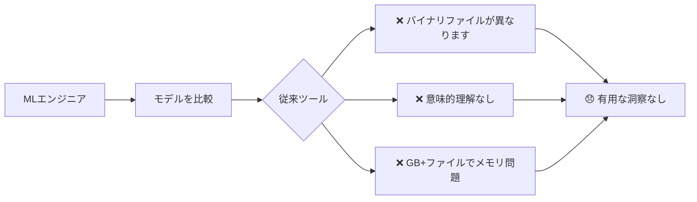
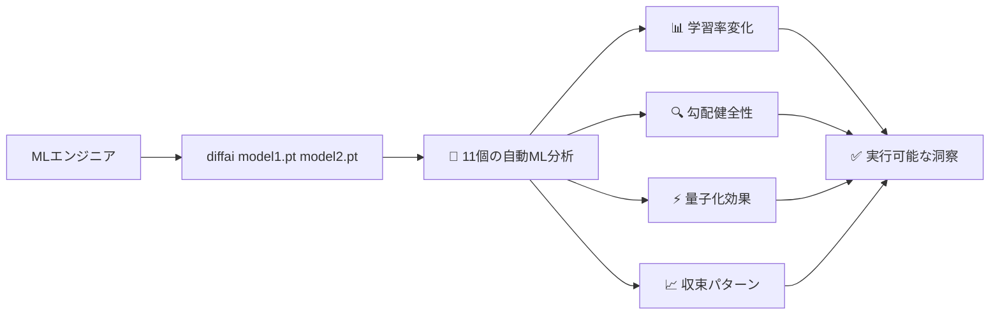

# diffai

> **PyTorch、Safetensors、NumPy、MATLABファイル専用のAI/ML特化diffツール**

[](https://github.com/kako-jun/diffai/actions/workflows/ci.yml)
[](https://crates.io/crates/diffai)
[](https://www.npmjs.com/package/diffai-js)
[](https://pypi.org/project/diffai-python/)

## 🤔 課題

従来のdiffツールは、AI/MLワークフローでは完全に役に立ちません：



**現実確認：** 2つのPyTorchモデルを比較する必要がある時、`git diff`や標準ツールは何も有用な情報をくれません。

## ✨ 解決策

diffaiは、AI/MLファイルを自動分析し、設定不要で**11個の専門的ML分析機能**を提供します：



**設定より規約：** セットアップ不要 - diffaiがAI/MLファイルを検出し、自動的に包括的分析を実行します。

## 🆚 従来ツールとの比較

| 課題 | 従来ツール | diffai |
|-----|-----------|---------|
| **バイナリモデルファイル** | "バイナリファイルが異なります" | 11個の専門ML分析 + テンソル統計 |
| **大容量ファイル(GB+)** | メモリ問題や失敗 | lawkitパターンによる効率的ストリーミング |
| **ML意味論** | 理解なし | 学習率、勾配、量子化検出 |
| **自動化** | 手動検査が必要 | MLOps統合用JSON出力 |
| **科学データ** | テキスト比較のみ | NumPy/MATLAB統計分析 |

## 🚀 クイックデモ

```bash
# 従来のdiff: MLファイルには無用
$ diff model_v1.safetensors model_v2.safetensors
Binary files model_v1.safetensors and model_v2.safetensors differ

# diffai: 包括的ML分析を自動実行
$ diffai model_v1.safetensors model_v2.safetensors
learning_rate_analysis: old=0.001, new=0.0015, change=+50.0%, trend=increasing
optimizer_comparison: type=Adam, momentum_change=+2.1%, state_evolution=stable
gradient_analysis: flow_health=healthy, norm=0.021069, variance_change=+15.3%
quantization_analysis: mixed_precision=FP16+FP32, compression=12.5%, precision_loss=1.2%
convergence_analysis: status=converging, stability=0.92, plateau_detected=false
# ... + 6個の分析が自動実行
  ~ fc1.weight: mean=-0.0002->-0.0001, std=0.0514->0.0716
  ~ fc2.weight: mean=-0.0008->-0.0018, std=0.0719->0.0883
```

## ✅ diffaiが今日できること

- **PyTorch/Safetensorsファイル**: 11個の自動ML分析機能
- **NumPy/MATLABファイル**: 包括的テンソル統計（形状、平均、標準偏差、データ型）
- **複数出力フォーマット**: 人間読み取り可能CLI、自動化用JSON、レポート用YAML
- **メモリ効率**: ストリーミング処理でGB+モデルファイルを処理
- **ゼロ設定**: ファイル形式検出による自動分析
- **MLOps統合**: CI/CDパイプラインと自動化用JSON出力

## ❌ diffaiができないこと（現実的に）

- ❌ **TensorFlow形式** (.pb, .h5, SavedModel) - これらにはTensorBoardを使用
- ❌ **ONNXモデル** - 可視化にはnetronを検討
- ❌ **ライブ訓練監視** - リアルタイム追跡にはwandb/tensorboardを使用
- ❌ **モデル性能予測** - 変化は表示するが、絶対性能は表示しない
- ❌ **自動ハイパーパラメータ調整** - 分析のみ、推奨事項はまだ未対応
- ❌ **一般的なテキスト/コードファイル** - JSON/YAML/CSVには[diffx](https://github.com/kako-jun/diffx)を使用

## 🔄 diffai vs 代替案の使い分け

| あなたの目標 | 代わりにこれを使用 | 理由 |
|-------------|------------------|-----|
| ライブ訓練監視 | TensorBoard, wandb | 訓練中のリアルタイム可視化 |
| モデル構造可視化 | netron, torchviz | インタラクティブなネットワーク図 |
| 実験追跡 | MLflow, Neptune | 完全な実験ライフサイクル管理 |
| 性能ベンチマーク | MLPerf, カスタムスクリプト | 推論/訓練速度に特化 |
| 一般的なファイル比較 | diffx, git diff | テキストベース構造化データ |

**diffaiが最適なケース：** 訓練後のモデル比較、チェックポイント分析、MLOps自動化。

## 📥 インストール

```bash
# crates.ioから（推奨）
cargo install diffai

# ソースから
git clone https://github.com/kako-jun/diffai.git
cd diffai && cargo build --release
```

## 🎯 一般的な使用例

### 研究開発
```bash
# ファインチューニング前後の比較
diffai pretrained_model.pt finetuned_model.pt
# 自動検出: パラメータ変化、収束パターン、勾配健全性
```

### MLOps & CI/CD
```bash
# パイプラインでの自動モデル検証
diffai production_model.safetensors candidate_model.safetensors --output json
# 分析結果に基づく自動意思決定にパイプ
```

### モデル最適化
```bash
# 量子化効果の分析
diffai full_precision.pt quantized.pt
# 自動検出: 圧縮率、精度損失、性能への影響
```

## 📚 ドキュメント

- **[クイックスタート](docs/quick-start_ja.md)** - 5分で開始
- **[ML分析](docs/ml-analysis_ja.md)** - 11個の自動ML分析機能を理解
- **[ファイル形式](docs/formats_ja.md)** - サポート形式と出力オプション
- **[使用例](docs/examples/)** - 実際の使用例と出力
- **[APIリファレンス](docs/reference/api-reference_ja.md)** - プログラミングインターフェース（Rust/Python/JavaScript）
- **[CLIリファレンス](docs/reference/cli-reference_ja.md)** - コマンドラインオプションと使用法

## 🔧 技術詳細

### サポート形式
- **PyTorch** (.pt, .pth) - 完全ML分析 + テンソル統計
- **Safetensors** (.safetensors) - 完全ML分析 + テンソル統計  
- **NumPy** (.npy, .npz) - テンソル統計のみ
- **MATLAB** (.mat) - テンソル統計のみ

### 11個の自動ML分析機能
1. **学習率分析** - 訓練動力学追跡
2. **オプティマイザ比較** - Adam/SGD状態分析
3. **損失追跡** - 収束パターン検出
4. **精度追跡** - 性能指標進化
5. **モデルバージョン分析** - チェックポイント進行
6. **勾配分析** - フロー健全性、消失/爆発検出
7. **量子化分析** - 混合精度（FP32/FP16/INT8/INT4）検出
8. **収束分析** - 学習曲線、プラトー検出
9. **活性化分析** - ReLU/GELU/Tanh分布
10. **アテンション分析** - Transformerメカニズム検出
11. **アンサンブル分析** - マルチモデル構造検出

### 出力形式
```bash
# 人間読み取り可能（デフォルト）
diffai model1.pt model2.pt

# 自動化用JSON
diffai model1.pt model2.pt --output json

# レポート用YAML  
diffai model1.pt model2.pt --output yaml

# 詳細診断
diffai model1.pt model2.pt --verbose
```

## 🏗️ 技術基盤

- **Rust** - 性能とメモリ安全性
- **diffx-core** - 実績のあるdiffエンジン基盤
- **lawkitパターン** - メモリ効率的な増分統計
- **設定より規約** - ゼロセットアップ哲学

## 🤝 貢献

貢献を歓迎します！ガイドラインは[CONTRIBUTING.md](CONTRIBUTING.md)をご覧ください。

```bash
git clone https://github.com/kako-jun/diffai.git
cd diffai
cargo build && cargo test
```

## 📄 ライセンス

MITライセンス - 詳細は[LICENSE](LICENSE)ファイルをご覧ください。

## 🔗 関連プロジェクト

- **[diffx](https://github.com/kako-jun/diffx)** - 汎用構造化データdiff（JSON、YAML、CSV、XML）
- **[lawkit](https://github.com/kako-jun/lawkit)** - メモリ効率的データ処理パターン
- **[safetensors](https://github.com/huggingface/safetensors)** - 安全なテンソル保存形式

---

**結論：** diffaiは、従来ツールでは不可能なAI/MLモデル比較からの実行可能な洞察を提供します。セットアップ不要 - モデルを指定するだけで自動的に包括的分析が得られます。