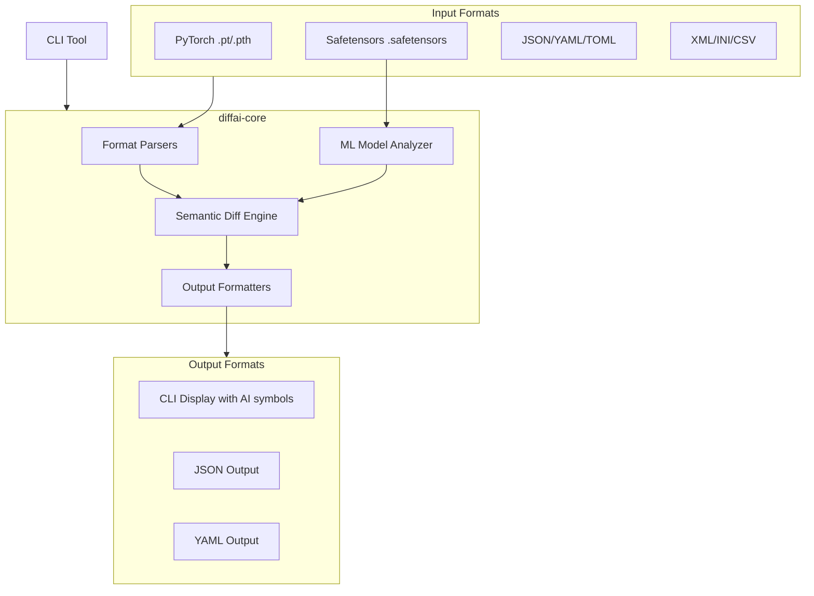

# diffai

> **🤖 AI/ML特化の差分ツール - フォーマットノイズではなく、モデル変更に焦点を当てる**

[日本語版 README](README_ja.md) | [English README](README.md)

[](https://github.com/kako-jun/diffai/actions/workflows/ci.yml)
[](https://crates.io/crates/diffai)
[](https://github.com/kako-jun/diffai/tree/main/docs/index_ja.md)
[](LICENSE)

モデル構造、テンソル統計、実験データを理解する**AI/MLワークフロー**に特化した次世代差分ツール。単なるテキスト変更ではなく、PyTorch、Safetensors、JSON設定、構造化データに最適化されています。

```bash
# 従来のdiffはモデル構造を理解できない
$ diff model_v1.safetensors model_v2.safetensors
Binary files model_v1.safetensors and model_v2.safetensors differ

# diffaiは意味のあるモデル変更を表示
$ diffai model_v1.safetensors model_v2.safetensors
⬚ tensor.linear1.weight: [256, 128] -> [512, 128]
📊 tensor.linear2.weight: mean=0.0012→0.0098, std=0.9987→1.0234
+ tensor.new_layer.weight: shape=[64, 64], dtype=f32, params=4096
```

## ✨ 主な機能

- **🧠 AI/ML特化**: PyTorch (.pt/.pth) と Safetensors (.safetensors) モデルのネイティブサポート
- **📊 テンソル分析**: テンソル統計の自動計算（平均、標準偏差、最小値、最大値、形状）
- **🔥 高度な分析**: レイヤー影響分析、量子化分析、変更量ソート
- **📈 ML統計**: `--stats` フラグによる詳細なモデル統計
- **🔧 多様な形式**: JSON、YAML、TOML、XML、INI、CSV サポート（diffxから継承）
- **🤖 MLOps対応**: 自動化とCI/CDパイプラインに最適なクリーンなCLI出力
- **⚡ 高速**: 大容量モデルファイルでの最高性能を実現するRust製
- **🎯 意味認識**: 意味のある変更に焦点、フォーマットノイズを無視

## 🚀 汎用的なdiffツールではなくdiffaiを選ぶ理由

従来のdiffツールはAI/MLワークフローでは失敗します：

| 課題 | 従来ツール | diffai |
|-----------|------------------|---------|
| **バイナリモデルファイル** | "バイナリファイルが異なる" 🚫 | テンソルレベル分析 ✅ |
| **大容量ファイル (GB+)** | メモリ問題 🚫 | 効率的ストリーミング ✅ |
| **統計的変更** | 洞察なし 🚫 | 平均/標準偏差/形状比較 ✅ |
| **ML特化形式** | サポートなし 🚫 | ネイティブ PyTorch/Safetensors ✅ |
| **実験追跡** | 手作業 🚫 | 自動化された分析 ✅ |

## 📊 Real-World Use Cases

### 🔬 Model Development

```bash
# Compare before/after fine-tuning
diffai pretrained_model.safetensors finetuned_model.safetensors

# Analyze quantization impact
diffai model_fp32.safetensors model_int8.safetensors --epsilon 0.01

# Track training progress
diffai checkpoint_epoch_10.pt checkpoint_epoch_20.pt
```

### 🚀 MLOps & Production

```bash
# CI/CD model validation
diffai production_model.safetensors candidate_model.safetensors --output json

# A/B testing preparation
diffai model_a.safetensors model_b.safetensors --output yaml > deployment_diff.yaml

# Experiment configuration tracking
diffai config_baseline.json config_optimized.json --ignore-keys-regex "^timestamp$"
```

### 📈 Research & Experimentation

```bash
# Architecture comparison
diffai resnet_model.safetensors transformer_model.safetensors

# Hyperparameter impact analysis
diffai model_lr_001.safetensors model_lr_0001.safetensors

# Data drift detection in model weights
diffai model_dataset_v1.safetensors model_dataset_v2.safetensors
```

## 🏗️ アーキテクチャ

### システム概要



### プロジェクト構造

```
diffai/
├── diffai-core/     # Core diff library with ML support
├── diffai-cli/      # CLI wrapper
├── tests/           # Comprehensive test suite
│   ├── fixtures/    # Test data including ML models
│   ├── integration/ # CLI integration tests
│   ├── unit/        # Core library unit tests
│   └── output/      # Test intermediate files
├── docs/            # AI/ML focused documentation
├── examples/        # Real-world ML use cases
└── scripts/         # Model generation utilities
```

### 技術スタック

- **Rust** （大容量モデルに対して高速、安全、メモリ効率的）
- **AI/ML**: `candle-core`, `safetensors`, `bytemuck` テンソル処理用
- **パーサー**: `serde_json`, `serde_yml`, `toml`, `quick-xml`, `csv`
- **CLI**: `clap` （引数解析）, `colored` （AIフレンドリー出力）

## 🚀 クイックスタート

### インストール

```bash
# crates.ioからインストール
cargo install diffai

# またはソースからビルド
git clone https://github.com/kako-jun/diffai.git
cd diffai
cargo install --path diffai-cli
```

### 基本的な使用方法

```bash
# MLモデルファイルの比較
diffai model1.safetensors model2.safetensors

# 異なる出力形式での比較
diffai config.yaml config_new.yaml --output json
diffai experiment.json experiment_v2.json --output yaml

# 高度なML特化オプション
diffai large_model.pt large_model_v2.pt --epsilon 1e-6
diffai config.json config_new.json --ignore-keys-regex "^(timestamp|run_id)$"

# 実験追跡用のディレクトリ比較
diffai experiment_v1/ experiment_v2/ --recursive
```

### MLモデル分析の例

```bash
# ファインチューニング分析
diffai models/base.safetensors models/finetuned.safetensors
# 出力:
# 📊 tensor.transformer.h.0.attn.weight: mean=0.0023→0.0156, std=0.0891→0.1234
# ⬚ tensor.classifier.weight: [768, 1000] -> [768, 10]

# 量子化影響評価
diffai models/fp32.safetensors models/int8.safetensors --epsilon 0.1
# 出力:
# 📊 tensor.conv1.weight: mean=0.0045→0.0043, std=0.2341→0.2298
# 差異は見つからない（エプシロン許容値内）

# 学習チェックポイントの進捗
diffai checkpoints/epoch_10.pt checkpoints/epoch_50.pt
# 出力:
# 📊 tensor.layers.0.weight: mean=-0.0012→0.0034, std=1.2341→0.8907
# 📊 tensor.layers.1.bias: mean=0.1234→0.0567, std=0.4567→0.3210
```

## 🔗 統合例

### CI/CDパイプライン

```yaml
name: Model Validation
on: [push, pull_request]
jobs:
  model-diff:
    runs-on: ubuntu-latest
    steps:
      - uses: actions/checkout@v4
      - name: Install diffai
        run: cargo install diffai
      - name: Compare model changes
        run: |
          diffai models/baseline.safetensors models/candidate.safetensors \
            --output json > model_diff.json
          # デプロイメント決定のためにmodel_diff.jsonを処理
```

### MLflow統合

```python
import subprocess
import json
import mlflow

def compare_models(model1_path, model2_path):
    result = subprocess.run([
        'diffai', model1_path, model2_path, '--output', 'json'
    ], capture_output=True, text=True)
    
    diff_data = json.loads(result.stdout)
    
    # モデル比較をMLflowにログ
    with mlflow.start_run():
        mlflow.log_dict(diff_data, "model_comparison.json")
        mlflow.log_metric("tensor_changes", len(diff_data))
```

### Pre-commitフック

```bash
#!/bin/bash
# .git/hooks/pre-commit
if diffai models/current.safetensors models/staging.safetensors \
   --output json | jq -e '.[] | select(.TensorStatsChanged)' > /dev/null; then
  echo "⚠️  重要なモデル変更が検出されました。確認してください:"
  diffai models/current.safetensors models/staging.safetensors
  read -p "コミットを継続しますか? (y/N) " -n 1 -r
  echo
  if [[ ! $REPLY =~ ^[Yy]$ ]]; then
    exit 1
  fi
fi
```

## 🎯 diffxとの関係

`diffai` は[`diffx`](https://github.com/kako-jun/diffx)プロジェクトの特化フォークであり、強固な構造化データ比較機能を継承しつつ、AI/ML特化機能を追加しています：

### diffxから継承
- ✅ **意味的差分** JSON、YAML、TOML、XML、INI、CSV用
- ✅ **形式自動検出** ファイル拡張子から
- ✅ **複数出力形式** （CLI、JSON、YAML、Unified）
- ✅ **高度なフィルタリング** （正規表現、パスベース、エプシロン許容値）
- ✅ **ディレクトリ比較** 再帰トラバーサル付き

### AI/ML用に追加
- 🆕 **PyTorchモデルサポート** (.pt, .pth ファイル)
- 🆕 **Safetensorsサポート** (.safetensors ファイル) 
- 🆕 **テンソル統計** （平均、標準偏差、最小値、最大値、形状、データ型）
- 🆕 **MLフレンドリーCLI出力** 特化シンボル付き
- 🆕 **モデルアーキテクチャ分析** （レイヤー数、パラメータ数）
- 🆕 **将来**: MLOpsツール統合、実験追跡

## 🔮 ロードマップ

### フェーズ1: コアML機能 ✅ **完成**
- ✅ PyTorch/Safetensorsファイル解析
- ✅ テンソル形状と統計比較
- ✅ シンボル付きAIフレンドリーCLI出力

### フェーズ2: 実験分析（次期）
- 🔄 **ハイパーパラメータ比較** JSON/YAML設定から
- 🔄 **学習曲線分析** 学習ログから
- 🔄 **統計的有意差テスト** メトリクス変更用

### フェーズ3: MLOps統合
- 📋 **MLflow統合** 自動実験比較用
- 📋 **Weights & Biases** エクスポート機能
- 📋 **DVC互換性** データ/モデルバージョニング用

### フェーズ4: 高度な分析
- 📋 **勾配分析** 学習デバッグ用
- 📋 **アテンションパターン比較** トランスフォーマーモデル用
- 📋 **埋め込み空間分析** 表現学習用

## 🤝 コントリビューション

AI/MLコミュニティからのコントリビューションを歓迎します！ガイドラインは[CONTRIBUTING.md](CONTRIBUTING.md)をご覧ください。

**サポートが必要な分野:**
- 🧠 追加のMLフレームワークサポート (TensorFlow, ONNX, JAX)
- 📊 高度な統計分析機能
- 🔧 MLOpsツール統合
- 📚 ドキュメントと例
- 🧪 実世界のモデルでのテスト

## 🏆 コミュニティ

- **GitHub Discussions**: 使用例を共有し、サポートを得る
- **Issues**: バグ報告や機能リクエスト
- **Pull Requests**: コードやドキュメントのコントリビューション

## 📄 ライセンス

MIT License - 詳細は[LICENSE](LICENSE)をご覧ください。

---

<sub>AI/MLコミュニティへの❤️を込めて作成。現代のMLワークフローでのより良いモデル比較ツールの必要性にインスパイアされて。</sub>