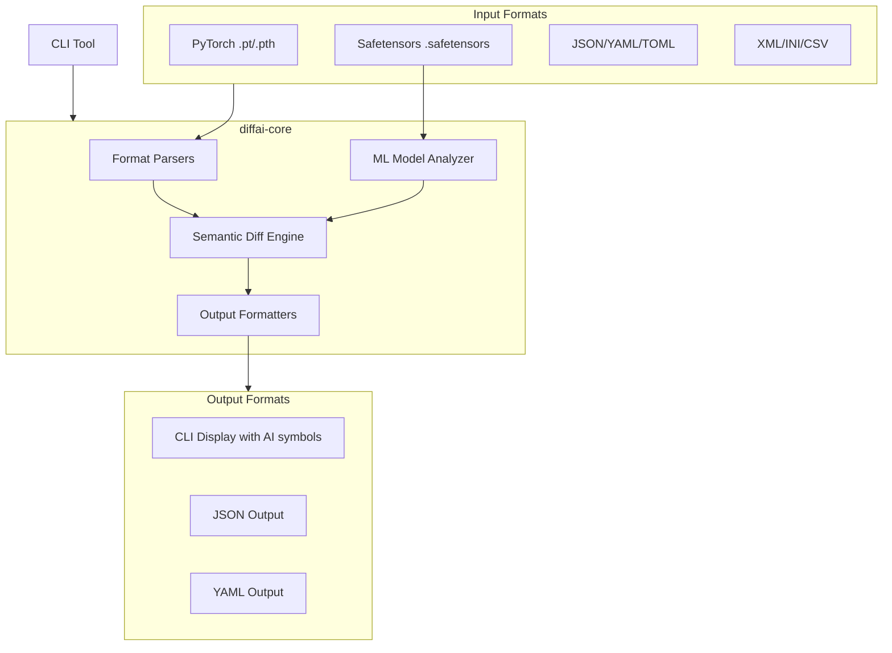

# diffai

> **🤖 AI/ML specialized diff tool - Focus on model changes, not formatting noise**

[日本語版 README](README_ja.md) | [English README](README.md)

[](https://github.com/kako-jun/diffai/actions/workflows/ci.yml)
[](https://crates.io/crates/diffai)
[](https://github.com/kako-jun/diffai/tree/main/docs/index_ja.md)
[](LICENSE)

A next-generation diff tool specialized for **AI/ML workflows** that understands model structures, tensor statistics, and experiment data - not just text changes. Perfect for PyTorch, Safetensors, JSON configs, and structured data.

```bash
# Traditional diff can't understand model structure
$ diff model_v1.safetensors model_v2.safetensors
Binary files model_v1.safetensors and model_v2.safetensors differ

# diffai shows semantic model changes
$ diffai model_v1.safetensors model_v2.safetensors
⬚ tensor.linear1.weight: [256, 128] -> [512, 128]
📊 tensor.linear2.weight: mean=0.0012→0.0098, std=0.9987→1.0234
+ tensor.new_layer.weight: shape=[64, 64], dtype=f32, params=4096
```

## ✨ Key Features

- **🧠 AI/ML Specialized**: Native support for PyTorch (.pt/.pth) and Safetensors (.safetensors) models
- **📊 Tensor Analysis**: Automatic calculation of tensor statistics (mean, std, min, max, shape)
- **🔥 Advanced Analytics**: Layer impact analysis, quantization analysis, change magnitude sorting
- **📈 ML Statistics**: Detailed model statistics with `--stats` flag
- **🔧 Multiple Formats**: JSON, YAML, TOML, XML, INI, CSV support (inherited from diffx)
- **🤖 MLOps Friendly**: Clean CLI output perfect for automation and CI/CD pipelines
- **⚡ Fast**: Built in Rust for maximum performance with large model files
- **🎯 Semantic Awareness**: Focuses on meaningful changes, ignores formatting noise

## 🚀 Why diffai over generic diff tools?

Traditional diff tools fail with AI/ML workflows:

| Challenge | Traditional Tools | diffai |
|-----------|------------------|---------|
| **Binary model files** | "Binary files differ" 🚫 | Tensor-level analysis ✅ |
| **Large files (GB+)** | Memory issues 🚫 | Efficient streaming ✅ |
| **Statistical changes** | No insight 🚫 | Mean/std/shape comparison ✅ |
| **ML-specific formats** | No support 🚫 | Native PyTorch/Safetensors ✅ |
| **Experiment tracking** | Manual work 🚫 | Automated analysis ✅ |

## 📊 Real-World Use Cases

### 🔬 Model Development

```bash
# Compare before/after fine-tuning
diffai pretrained_model.safetensors finetuned_model.safetensors

# Analyze quantization impact
diffai model_fp32.safetensors model_int8.safetensors --epsilon 0.01

# Track training progress
diffai checkpoint_epoch_10.pt checkpoint_epoch_20.pt
```

### 🚀 MLOps & Production

```bash
# CI/CD model validation
diffai production_model.safetensors candidate_model.safetensors --output json

# A/B testing preparation
diffai model_a.safetensors model_b.safetensors --output yaml > deployment_diff.yaml

# Experiment configuration tracking
diffai config_baseline.json config_optimized.json --ignore-keys-regex "^timestamp$"
```

### 📈 Research & Experimentation

```bash
# Architecture comparison
diffai resnet_model.safetensors transformer_model.safetensors

# Hyperparameter impact analysis
diffai model_lr_001.safetensors model_lr_0001.safetensors

# Data drift detection in model weights
diffai model_dataset_v1.safetensors model_dataset_v2.safetensors
```

## 🏗️ Architecture

### System Overview



### Project Structure

```
diffai/
├── diffai-core/     # Core diff library with ML support
├── diffai-cli/      # CLI wrapper
├── tests/           # Comprehensive test suite
│   ├── fixtures/    # Test data including ML models
│   ├── integration/ # CLI integration tests
│   ├── unit/        # Core library unit tests
│   └── output/      # Test intermediate files
├── docs/            # AI/ML focused documentation
├── examples/        # Real-world ML use cases
└── scripts/         # Model generation utilities
```

### Technology Stack

- **Rust** (Fast, safe, memory-efficient for large models)
- **AI/ML**: `candle-core`, `safetensors`, `bytemuck` for tensor processing
- **Parsers**: `serde_json`, `serde_yml`, `toml`, `quick-xml`, `csv`
- **CLI**: `clap` (argument parsing), `colored` (AI-friendly output)

## 🚀 Quick Start

### Installation

```bash
# Install from crates.io
cargo install diffai

# Or build from source
git clone https://github.com/kako-jun/diffai.git
cd diffai
cargo install --path diffai-cli
```

### Basic Usage

```bash
# Compare ML model files
diffai model1.safetensors model2.safetensors

# Compare with different output formats
diffai config.yaml config_new.yaml --output json
diffai experiment.json experiment_v2.json --output yaml

# Advanced ML-specific options
diffai large_model.pt large_model_v2.pt --epsilon 1e-6
diffai config.json config_new.json --ignore-keys-regex "^(timestamp|run_id)$"

# Directory comparison for experiment tracking
diffai experiment_v1/ experiment_v2/ --recursive
```

### ML Model Analysis Examples

```bash
# Fine-tuning analysis
diffai models/base.safetensors models/finetuned.safetensors
# Output:
# 📊 tensor.transformer.h.0.attn.weight: mean=0.0023→0.0156, std=0.0891→0.1234
# ⬚ tensor.classifier.weight: [768, 1000] -> [768, 10]

# Quantization impact assessment
diffai models/fp32.safetensors models/int8.safetensors --epsilon 0.1
# Output:
# 📊 tensor.conv1.weight: mean=0.0045→0.0043, std=0.2341→0.2298
# No differences found (within epsilon tolerance)

# Training checkpoint progression
diffai checkpoints/epoch_10.pt checkpoints/epoch_50.pt
# Output:
# 📊 tensor.layers.0.weight: mean=-0.0012→0.0034, std=1.2341→0.8907
# 📊 tensor.layers.1.bias: mean=0.1234→0.0567, std=0.4567→0.3210
```

## 🔗 Integration Examples

### CI/CD Pipeline

```yaml
name: Model Validation
on: [push, pull_request]
jobs:
  model-diff:
    runs-on: ubuntu-latest
    steps:
      - uses: actions/checkout@v4
      - name: Install diffai
        run: cargo install diffai
      - name: Compare model changes
        run: |
          diffai models/baseline.safetensors models/candidate.safetensors \
            --output json > model_diff.json
          # Process model_diff.json for deployment decisions
```

### MLflow Integration

```python
import subprocess
import json
import mlflow

def compare_models(model1_path, model2_path):
    result = subprocess.run([
        'diffai', model1_path, model2_path, '--output', 'json'
    ], capture_output=True, text=True)
    
    diff_data = json.loads(result.stdout)
    
    # Log model comparison to MLflow
    with mlflow.start_run():
        mlflow.log_dict(diff_data, "model_comparison.json")
        mlflow.log_metric("tensor_changes", len(diff_data))
```

### Pre-commit Hook

```bash
#!/bin/bash
# .git/hooks/pre-commit
if diffai models/current.safetensors models/staging.safetensors \
   --output json | jq -e '.[] | select(.TensorStatsChanged)' > /dev/null; then
  echo "⚠️  Significant model changes detected. Please review:"
  diffai models/current.safetensors models/staging.safetensors
  read -p "Continue with commit? (y/N) " -n 1 -r
  echo
  if [[ ! $REPLY =~ ^[Yy]$ ]]; then
    exit 1
  fi
fi
```

## 🎯 Relationship to diffx

`diffai` is a specialized fork of the [`diffx`](https://github.com/kako-jun/diffx) project, inheriting its robust structured data comparison capabilities while adding AI/ML-specific features:

### Inherited from diffx
- ✅ **Semantic diff** for JSON, YAML, TOML, XML, INI, CSV
- ✅ **Format auto-detection** from file extensions
- ✅ **Multiple output formats** (CLI, JSON, YAML, Unified)
- ✅ **Advanced filtering** (regex, path-based, epsilon tolerance)
- ✅ **Directory comparison** with recursive traversal

### Added for AI/ML
- 🆕 **PyTorch model support** (.pt, .pth files)
- 🆕 **Safetensors support** (.safetensors files) 
- 🆕 **Tensor statistics** (mean, std, min, max, shape, dtype)
- 🆕 **ML-friendly CLI output** with specialized symbols
- 🆕 **Model architecture analysis** (layer counts, parameter counts)
- 🆕 **Future**: Integration with MLOps tools, experiment tracking

## 🔮 Roadmap

### Phase 1: Core ML Features ✅ **COMPLETED**
- ✅ PyTorch/Safetensors file parsing
- ✅ Tensor shape and statistics comparison
- ✅ AI-friendly CLI output with symbols

### Phase 2: Experiment Analysis (Next)
- 🔄 **Hyperparameter comparison** from JSON/YAML configs
- 🔄 **Learning curve analysis** from training logs
- 🔄 **Statistical significance testing** for metric changes

### Phase 3: MLOps Integration
- 📋 **MLflow integration** for automatic experiment comparison
- 📋 **Weights & Biases** export functionality
- 📋 **DVC compatibility** for data/model versioning

### Phase 4: Advanced Analytics
- 📋 **Gradient analysis** for training debugging
- 📋 **Attention pattern comparison** for transformer models
- 📋 **Embedding space analysis** for representation learning

## 🤝 Contributing

We welcome contributions from the AI/ML community! See [CONTRIBUTING.md](CONTRIBUTING.md) for guidelines.

**Areas where we need help:**
- 🧠 Additional ML framework support (TensorFlow, ONNX, JAX)
- 📊 Advanced statistical analysis features
- 🔧 MLOps tool integrations
- 📚 Documentation and examples
- 🧪 Testing with real-world models

## 🏆 Community

- **GitHub Discussions**: Share use cases and get help
- **Issues**: Report bugs or request features
- **Pull Requests**: Contribute code or documentation

## 📄 License

MIT License - see [LICENSE](LICENSE) for details.

---

<sub>Built with ❤️ for the AI/ML community. Inspired by the need for better model comparison tools in modern ML workflows.</sub>