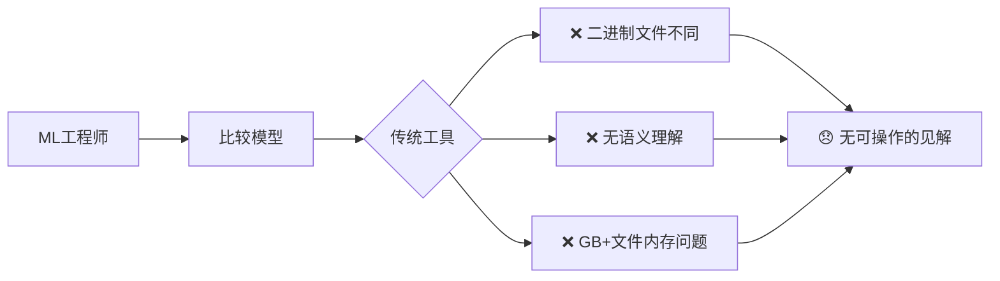
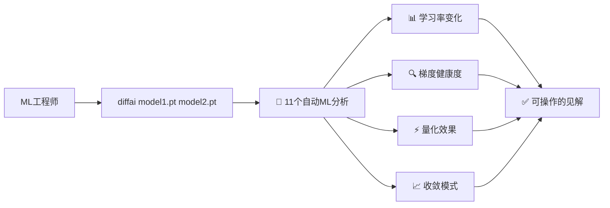

# diffai

> **专门针对PyTorch、Safetensors、NumPy和MATLAB文件的AI/ML特化diff工具**

[](https://github.com/kako-jun/diffai/actions/workflows/ci.yml)
[](https://crates.io/crates/diffai)
[](https://www.npmjs.com/package/diffai-js)
[](https://pypi.org/project/diffai-python/)

## 🤔 问题所在

传统diff工具在AI/ML工作流程中完全无效：



**现实检查：** 当您需要比较两个PyTorch模型时，`git diff`和标准工具无法给您任何有用的信息。

## ✨ 解决方案

diffai自动分析AI/ML文件，无需任何配置即可提供**11个专业ML分析功能**：



**约定优于配置：** 无需设置 - diffai检测AI/ML文件并自动运行全面分析。

## 🆚 与传统工具对比

| 挑战 | 传统工具 | diffai |
|------|----------|---------|
| **二进制模型文件** | "二进制文件不同" | 11个专业ML分析 + 张量统计 |
| **大文件(GB+)** | 内存问题或失败 | 使用lawkit模式的高效流处理 |
| **ML语义** | 无理解能力 | 学习率、梯度、量化检测 |
| **自动化** | 需要手动检查 | 用于MLOps集成的JSON输出 |
| **科学数据** | 仅文本比较 | NumPy/MATLAB统计分析 |

## 🚀 快速演示

```bash
# 传统diff：对ML文件无用
$ diff model_v1.safetensors model_v2.safetensors
Binary files model_v1.safetensors and model_v2.safetensors differ

# diffai：自动进行全面ML分析
$ diffai model_v1.safetensors model_v2.safetensors
learning_rate_analysis: old=0.001, new=0.0015, change=+50.0%, trend=increasing
optimizer_comparison: type=Adam, momentum_change=+2.1%, state_evolution=stable
gradient_analysis: flow_health=healthy, norm=0.021069, variance_change=+15.3%
quantization_analysis: mixed_precision=FP16+FP32, compression=12.5%, precision_loss=1.2%
convergence_analysis: status=converging, stability=0.92, plateau_detected=false
# ... + 6个更多分析自动进行
  ~ fc1.weight: mean=-0.0002->-0.0001, std=0.0514->0.0716
  ~ fc2.weight: mean=-0.0008->-0.0018, std=0.0719->0.0883
```

## ✅ diffai今天能做什么

- **PyTorch/Safetensors文件**：11个自动ML分析功能
- **NumPy/MATLAB文件**：全面张量统计（形状、均值、标准差、数据类型）
- **多种输出格式**：人类可读的CLI、自动化用JSON、报告用YAML
- **内存高效**：通过流处理处理GB+模型文件
- **零配置**：基于文件格式检测的自动分析
- **MLOps集成**：用于CI/CD管道和自动化的JSON输出

## ❌ diffai无法做什么（现实情况）

- ❌ **TensorFlow格式** (.pb, .h5, SavedModel) - 请使用TensorBoard
- ❌ **ONNX模型** - 可考虑使用netron进行可视化
- ❌ **实时训练监控** - 请使用wandb/tensorboard进行实时跟踪
- ❌ **模型性能预测** - 显示变化，不显示绝对性能
- ❌ **自动超参数调优** - 仅分析，暂无推荐功能
- ❌ **通用文本/代码文件** - 请使用[diffx](https://github.com/kako-jun/diffx)处理JSON/YAML/CSV

## 🔄 何时使用diffai与替代方案

| 您的目标 | 使用这个替代方案 | 原因 |
|----------|------------------|------|
| 实时训练监控 | TensorBoard, wandb | 训练期间的实时可视化 |
| 模型架构可视化 | netron, torchviz | 交互式网络图 |
| 实验跟踪 | MLflow, Neptune | 完整的实验生命周期管理 |
| 性能基准测试 | MLPerf, 自定义脚本 | 专注于推理/训练速度 |
| 通用文件比较 | diffx, git diff | 基于文本的结构化数据 |

**diffai最适合：** 训练后模型比较、检查点分析和MLOps自动化。

## 📥 安装

```bash
# 从crates.io安装（推荐）
cargo install diffai

# 从源码构建
git clone https://github.com/kako-jun/diffai.git
cd diffai && cargo build --release
```

## 🎯 常见用例

### 研究与开发
```bash
# 比较微调前后
diffai pretrained_model.pt finetuned_model.pt
# 自动检测：参数变化、收敛模式、梯度健康度
```

### MLOps与CI/CD
```bash
# 管道中的自动模型验证
diffai production_model.safetensors candidate_model.safetensors --output json
# 基于分析结果管道到自动决策
```

### 模型优化
```bash
# 分析量化效果
diffai full_precision.pt quantized.pt
# 自动检测：压缩比、精度损失、性能影响
```

## 📚 文档

- **[快速开始](docs/quick-start_zh.md)** - 5分钟快速上手
- **[ML分析](docs/ml-analysis_zh.md)** - 了解11个自动ML分析功能
- **[文件格式](docs/formats_zh.md)** - 支持的格式和输出选项
- **[示例](docs/examples/)** - 真实使用示例和输出
- **[API参考](docs/reference/api-reference_zh.md)** - 编程接口（Rust/Python/JavaScript）
- **[CLI参考](docs/reference/cli-reference_zh.md)** - 命令行选项和用法

## 🔧 技术细节

### 支持的格式
- **PyTorch** (.pt, .pth) - 完整ML分析 + 张量统计
- **Safetensors** (.safetensors) - 完整ML分析 + 张量统计
- **NumPy** (.npy, .npz) - 仅张量统计
- **MATLAB** (.mat) - 仅张量统计

### 11个自动ML分析功能
1. **学习率分析** - 训练动态跟踪
2. **优化器比较** - Adam/SGD状态分析
3. **损失跟踪** - 收敛模式检测
4. **准确率跟踪** - 性能指标演变
5. **模型版本分析** - 检查点进展
6. **梯度分析** - 流健康度、消失/爆炸检测
7. **量化分析** - 混合精度（FP32/FP16/INT8/INT4）检测
8. **收敛分析** - 学习曲线、平台期检测
9. **激活分析** - ReLU/GELU/Tanh分布
10. **注意力分析** - Transformer机制检测
11. **集成分析** - 多模型结构检测

### 输出格式
```bash
# 人类可读（默认）
diffai model1.pt model2.pt

# 自动化用JSON
diffai model1.pt model2.pt --output json

# 报告用YAML
diffai model1.pt model2.pt --output yaml

# 详细诊断
diffai model1.pt model2.pt --verbose
```

## 🏗️ 构建技术

- **Rust** - 性能和内存安全
- **diffx-core** - 经过验证的diff引擎基础
- **lawkit模式** - 内存高效的增量统计
- **约定优于配置** - 零设置理念

## 🤝 贡献

欢迎贡献！请查看[CONTRIBUTING.md](CONTRIBUTING.md)了解指南。

```bash
git clone https://github.com/kako-jun/diffai.git
cd diffai
cargo build && cargo test
```

## 📄 许可证

MIT许可证 - 详见[LICENSE](LICENSE)文件。

## 🔗 相关项目

- **[diffx](https://github.com/kako-jun/diffx)** - 通用结构化数据diff（JSON、YAML、CSV、XML）
- **[lawkit](https://github.com/kako-jun/lawkit)** - 内存高效的数据处理模式
- **[safetensors](https://github.com/huggingface/safetensors)** - 安全张量存储格式

---

**结论：** diffai为您提供传统工具根本无法提供的AI/ML模型比较可操作见解。无需设置 - 只需指向您的模型即可自动获得全面分析。